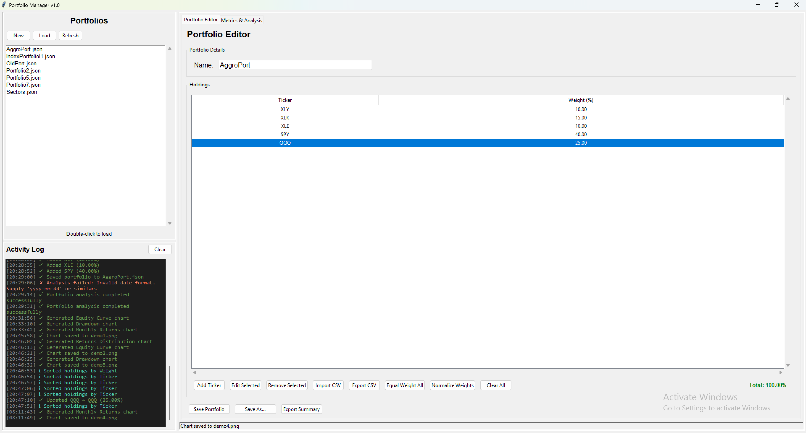
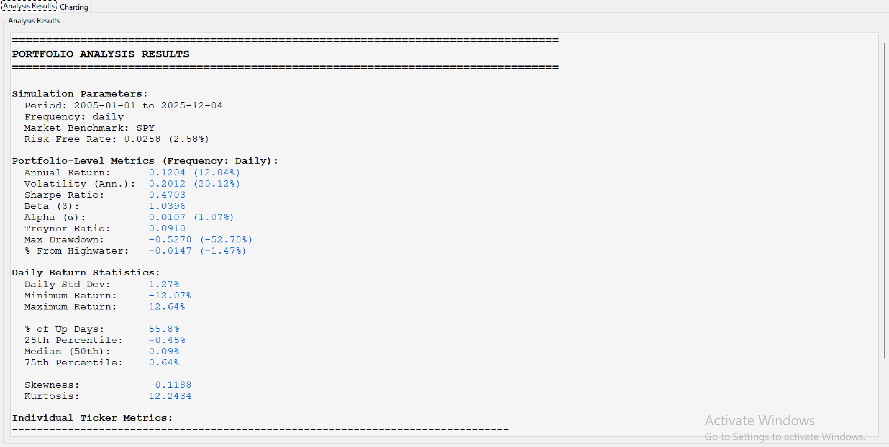
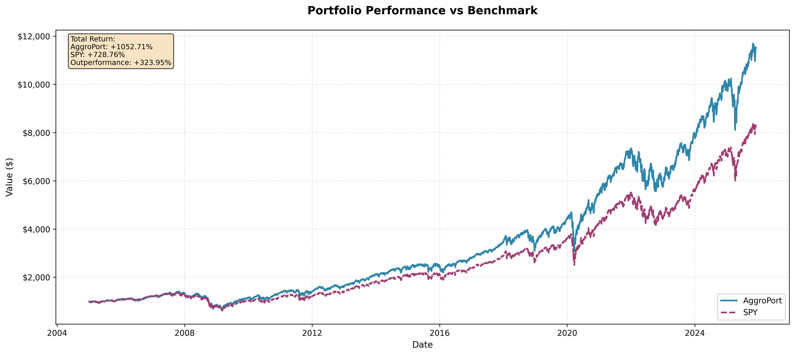
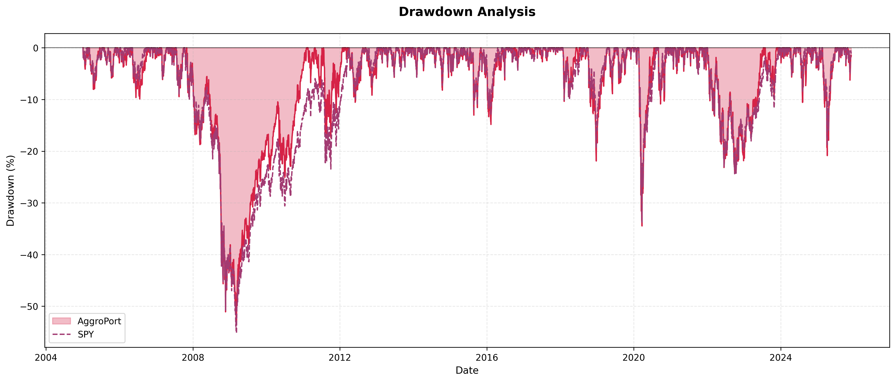
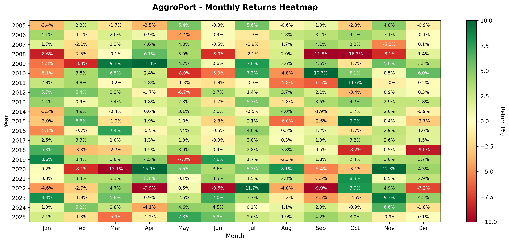

# Portfolio Builder / Analyzer

Portfolio Manager is a comprehensive Python-based desktop application for managing investment portfolios, analyzing performance metrics against market benchmarks, and visualizing risk-return profiles. Built with `tkinter` for the GUI and `pandas`/`matplotlib` for data handling and analysis.

**NOTE:** This project is a work-in-progress. Its current state only contains a fraction of its intended functionality and is meant to visualize and demonstrate its foundation.

## Bugs / To Implement

- Manage edge cases related to short portfolio timeframes – frequency and annualization concerns. 
- Deal with incomplete or missing data for tickers in the specified timeframe.
- Incorporate dividends – requires extensive metadata like historic ex-dividend, record dates, etc. Possibly start with flat or variable continuous accrual, although corporate action dates are required for precision, especially in more active strategies.
- Normalization often goes +/- a basis point or two; further rounding or actual $ value/share rounding needed in future for precision.
- SOFR data doesn't go back far enough. Fetch LIBOR prior to 2018 and refactor

BackTesterV1 is a comprehensive Python-based desktop application for managing investment portfolios, creating strategies, analyzing performance metrics against market benchmarks, and visualizing risk-return profiles. Built with `tkinter` for the GUI and `pandas`/`matplotlib` for data handling and analysis.




## Features

### 1. Portfolio Management

* **Create & Edit**: Easily create portfolios with custom weights.
* **Ticker Management**: Add, remove, or edit tickers. Support for manual weight entry or equal-weight distribution.
* **Normalization**: Auto-normalize weights to ensure they sum to 100%.
* **Persistence**: Save and load portfolios as JSON files.
* **CSV Support**: Import holdings from CSV or export current portfolio configurations.

### 2. Portfolio Analysis

Run detailed simulations against benchmarks (e.g., SPY) to calculate key metrics:

* **Risk/Return**: Annualized Return, Volatility, Sharpe Ratio, Treynor Ratio.
* **CAPM Metrics**: Beta (β) and Alpha (α) relative to the market.
* **Drawdown**: Max Drawdown calculation and percentage from High Water Mark.
* **Statistics**: Daily return distribution (Skewness, Kurtosis, Percentiles).

### 3. Charting

Visualize your portfolio's performance with interactive, exportable charts:

* **Equity Curve**: Compare cumulative returns vs. benchmark.  


* **Drawdown Chart**: Visualize underwater periods and depth.  


* **Monthly Heatmap**: Month-by-month return visualization.  


* **Distribution**: Histogram of daily returns with mean/median markers.

## Financial Formulas

This application uses the following quantitative finance formulas for portfolio analysis:

### 1. Realized Risk-Free Rate (SOFR)

Annualized risk-free rate from daily rates:

$$r_{\text{annualized}} = \left( \prod_{i=1}^{n} \left( 1 + \frac{\text{SOFR}_i}{252} \right) \right)^{\frac{252}{n}} - 1$$

where $\text{SOFR}_i$ is the daily SOFR rate, and $n$ is the number of days.

### 2. Daily Returns

$$r_{i} = \frac{P_i - P_{i-1}}{P_{i-1}}$$

where $P_i$ is the price at day $i$.

### 3. Annualized Volatility

$$\sigma_{\text{annualized}} = \text{std}(r_i) \times \sqrt{252}$$

### 4. Sharpe Ratio

$$\text{Sharpe Ratio} = \frac{\bar{r}_p - r_f}{\sigma_p}$$

where $\bar{r}_p$ is the portfolio mean return, $r_f$ is the risk-free rate, and $\sigma_p$ is portfolio volatility.

### 5. CAPM Metrics

**Beta:**

$$
\beta = \frac{\mathrm{Cov}(r_p, r_m)}{\mathrm{Var}(r_m)}
$$

**Alpha:**

$$
\alpha = \bar{r}_p - \left( r_f + \beta(\bar{r}_m - r_f) \right)
$$


where $r_m$ is the benchmark return.

### 6. Maximum Drawdown

$$
\text{Max Drawdown} = 
\max_{t \in [0, T]}
\left(
\frac{\text{Peak}_t - P_t}{\text{Peak}_t}
\right)
$$

where $$
\text{Peak}_t = \max_{s \le t} P_s
$$

### 7. Treynor Ratio

The Treynor Ratio measures **excess return per unit of systematic risk (β)**:

$$
\text{Treynor Ratio} = \frac{\bar{r}_p - r_f}{\beta}
$$

where:

- $\bar{r}_p$ = portfolio mean return  
- $r_f$ = risk-free rate  
- $\beta$ = portfolio beta relative to the benchmark

## Installation

### Prerequisites

* Python 3.8+
* The following Python packages:

```bash
pip install pandas numpy matplotlib
```


